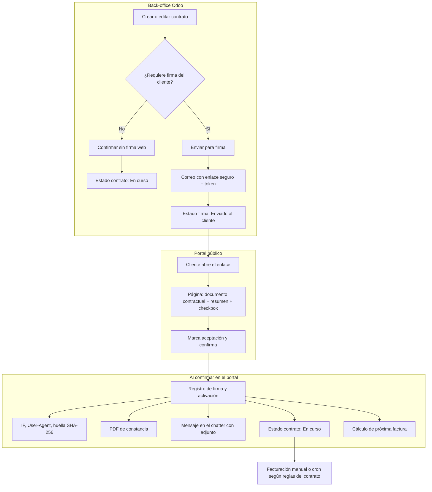

# Flujo operativo — Firma por portal y activación del contrato

**Módulo:** Contratos Recurrentes a Medida (Cositt)  
**Versión:** ver `cositt_contracts/__manifest__.py` (campo `version`).  
**Odoo:** 19 Community (sin Odoo Sign Enterprise)

Resume el **flujo de negocio** desde el back-office hasta la aceptación del cliente. Detalle técnico: [DOCUMENTACION_TECNICA.md](DOCUMENTACION_TECNICA.md). Instrucciones de usuario: [MANUAL_USO.md](../MANUAL_USO.md).

**Con ventas:** productos recurrentes + tipo Cositt → presupuesto → confirmar pedido → contratos → **Enviar contratos para firma** → portal (incluye bloque **Condiciones contractuales** si hay documento contractual) → copia por correo.

---

## Diagrama de flujo (visión usuario / proceso)

---

## Qué ocurre en cada bloque

| Fase | Descripción |
|------|-------------|
| **Back-office** | Sin firma web: **Confirmar (sin firma web)** → **En curso**. Con firma: **Enviar para firma** → correo y estado **Enviado al cliente**; el contrato sigue en **Nuevo** hasta la aceptación. |
| **Portal** | El cliente no inicia sesión en Odoo. Ruta `/cositt/contract/<token>`. Se muestra el texto contractual resuelto (`contract_body_rendered`) si está definido. |
| **Al confirmar** | `action_finalize_portal_signature`: evidencia, PDF, chatter, **En curso**, fechas de facturación; opcionalmente primera factura si está activada. |

---

## Estados de la firma (resumen)

| `signature_state` | Significado |
|-------------------|-------------|
| `na` | No requiere firma web. |
| `pending` | Pendiente de envío. |
| `sent` | Enlace enviado. |
| `signed` | Aceptado en el portal. |

El estado comercial **En curso** se alcanza al confirmar sin firma o al firmar en portal (según reglas del contrato).

---

## Documentación relacionada

- [MANUAL_USO.md](../MANUAL_USO.md)
- [DOCUMENTACION_TECNICA.md](DOCUMENTACION_TECNICA.md)

---

*Cositt / Gerard Perat — documentación del módulo.*
